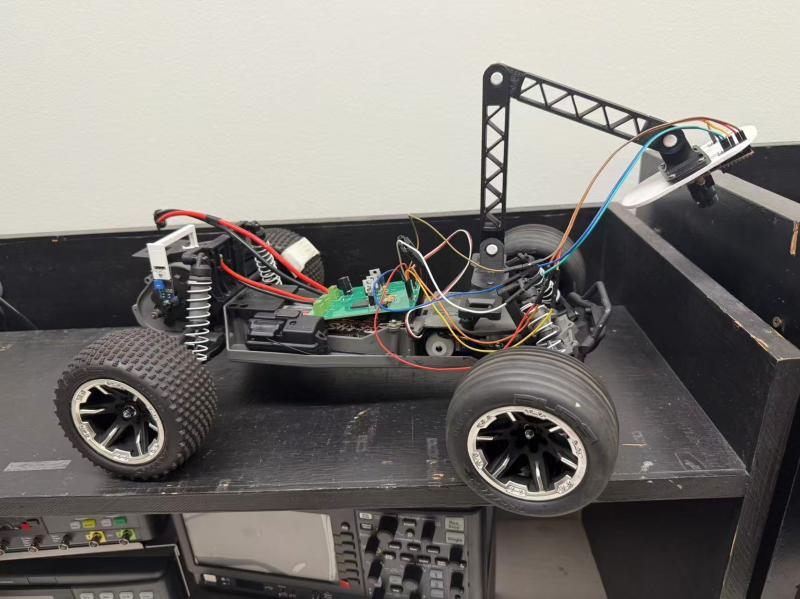
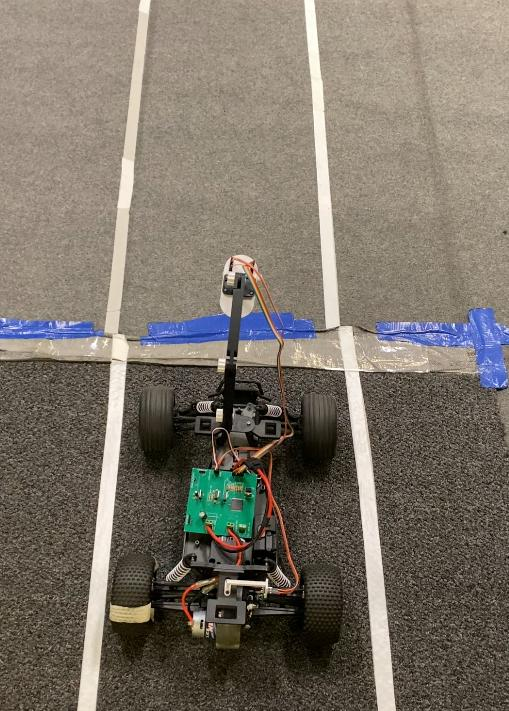
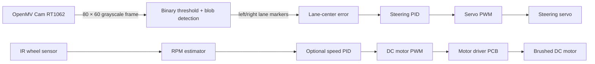

# Autonomous Lane-Following Vehicle

> UC Davis EEC 195A/B senior capstone (2024–2025) — a small autonomous vehicle that uses onboard vision and closed-loop steering to follow a marked lane.


## Overview

The vehicle converts a grayscale OpenMV camera image into a lane-center estimate, then uses a PID loop to command a steering servo. An IR sensor provides wheel-speed feedback; the cleaned firmware includes an optional speed-control loop and a conservative lane-loss failsafe.

**Competition outcome:** Team 16 completed two laps of the competition track in **49.3 seconds**, placing **7th overall**, as documented in the final project report.

The repository was reconstructed from the original capstone source and Altium project files in August 2026. It intentionally separates a deployable, documented firmware path from the historical experiment snapshots so the development process remains traceable.

## Prototype gallery

| Vehicle prototype | Lane-following test setup | Custom motor-control PCB |
| --- | --- | --- |
|  |  |  |

The images show the assembled vehicle, the taped two-line track used for testing, and a rendered view of the custom motor-control board. They document the physical prototype; they do not by themselves establish a quantitative performance metric.

## Demonstration video

[Watch the original final time-trial run](docs/assets/final-time-trial-medium-slow.mov) (MOV, 97 MB).

This is the original submitted recording, retained as a primary demonstration artifact. For a public-facing portfolio, add a compressed MP4 or a hosted video link alongside it so visitors can preview the run without downloading the source file.

## System architecture



## Repository layout

```text
firmware/openmv/       Cleaned OpenMV/MicroPython firmware to deploy
hardware/altium/       Native Altium project, schematic, and PCB layout
docs/                  Architecture, hardware, deployment, and validation notes
archive/firmware-history/
                        Unmodified historical iterations and experiments
```

## Hardware and software

| Area | Implementation |
| --- | --- |
| Vision | OpenMV Cam RT1062, grayscale QQQVGA (80 × 60), binary thresholding, blob-based lane center |
| Steering | PWM servo with configurable calibration limits and PID control |
| Drive | Brushed DC motor driven by the custom two-layer control PCB |
| Speed sensing | IR wheel/gear sensor with timer-window RPM estimation |
| Electronics | Altium Designer native schematic and PCB files |
| Mechanical | Adjustable 3D-printed camera mount (CAD source was not included in the recovered archive) |

See [architecture notes](docs/architecture.md) and [hardware notes](docs/hardware.md) for implementation details.

## Quick start

1. Install the OpenMV IDE and connect the OpenMV Cam RT1062.
2. Open [firmware/openmv/config.py](firmware/openmv/config.py) and calibrate the camera threshold, pin mapping, servo endpoints, and motor duty values for your vehicle.
3. Copy the four files in `firmware/openmv/` to the camera's filesystem, with `main.py` at the root.
4. Keep the wheels off the ground for the first run. Verify neutral steering, motor direction, and the lane-loss brake before track testing.

Detailed bring-up and safety guidance: [firmware/openmv/README.md](firmware/openmv/README.md).

## Design decisions

- **Blob-based lane center** was selected for the deployable firmware because the archive's final iteration detects left and right lane markers in a near-field region of interest, then steers to their midpoint.
- **Fixed camera settings** prevent auto-gain and white-balance changes from shifting the grayscale threshold during a run.
- **Speed control is documented, but deployment stays conservative.** The final report describes a second PID loop that adjusts motor PWM from IR-derived RPM. The recovered final code snapshot retains the measurement and PID pathway but leaves the output adjustment disabled. The reconstructed firmware exposes this loop behind `ENABLE_SPEED_PID` until it is recalibrated on the physical vehicle.
- **Safe lane-loss behavior** is the default: center steering immediately and brake after a small number of missed frames.

## Reported results and evidence

| Result | Reported value |
| --- | --- |
| Competition run | Two full laps |
| Completion time | 49.3 seconds |
| Overall rank | 7th |
| Field validation | 1,000+ real-world test runs |

These results and the design claims in this repository are sourced from the team-authored [final report](docs/reference/team-16-final-report.pdf) and [project poster](docs/reference/team-16-project-poster.pdf). The recovered archive still lacks raw telemetry, an exported BOM, Gerbers, and camera-mount CAD; the repository does not infer those missing artifacts.

Use the repeatable checklist in [docs/validation.md](docs/validation.md) for a new validation run.

## Historical source and attribution

`archive/firmware-history/` preserves the original files, including early line-regression and line-segment approaches. The cleaned firmware is a maintainable reconstruction based on the latest blob/PID implementation; it should be reviewed and calibrated before use on hardware. [Design rationale and source reconciliation](docs/design-decisions.md) explains the major choices and the differences between the report and recovered code snapshot.

This was a course team project. Confirm contributor names, institution branding, and reuse permissions with the team before publishing the repository under an open-source license.

## Roadmap

- [ ] Add schematic/PCB render exports and a BOM from Altium
- [ ] Add camera-mount CAD/STL files
- [ ] Add one full uncut track-run video and representative serial telemetry
- [ ] Tune and validate the optional speed PID on the final hardware
- [ ] Add a hardware-in-the-loop test record
