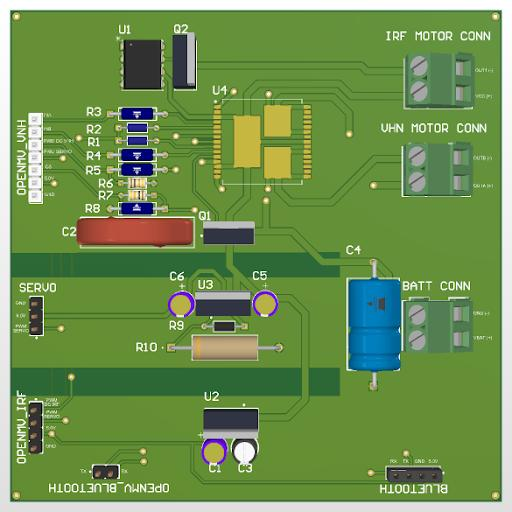

# Hardware design

The recovered Altium sources are tracked under [`hardware/altium/`](../hardware/altium/):

- `Lab_8_v3.PrjPcb` — Altium project
- `Lab_8_v3.SchDoc` — schematic source
- `Lab_8_v3.PcbDoc` — PCB layout source

Open the `.PrjPcb` file in Altium Designer to regenerate manufacturing outputs and documentation. The archive did not include a BOM, Gerbers, pick-and-place output, 3D model, or rendered schematic. Do not infer those artifacts from this repository; regenerate and review them from the native project before fabrication.

## Recovered interface map

The pin mapping below is taken from the latest archived firmware and is consolidated in `firmware/openmv/config.py`.

| Function | OpenMV pin | Notes |
| --- | --- | --- |
| Servo PWM | P2 | 100 Hz, calibrated around 1.5 ms |
| Motor PWM | P8 | 1.6 kHz |
| Motor direction A | P10 | Driven high in the final forward-only configuration |
| Motor direction B | P9 | Driven low in the final forward-only configuration |
| IR speed input | P5 | Falling-edge interrupt with pull-up |
| IR sensor ground | P6 | Driven low |

## Publication checklist

Before publishing fabrication-ready hardware, export and review:

1. PDF schematic and high-resolution PCB renders.
2. BOM with manufacturer part numbers and quantity.
3. Gerber, drill, board-outline, and pick-and-place files.
4. Power-tree and motor-current calculations.
5. Revision, date, and electrical-rule-check status.
